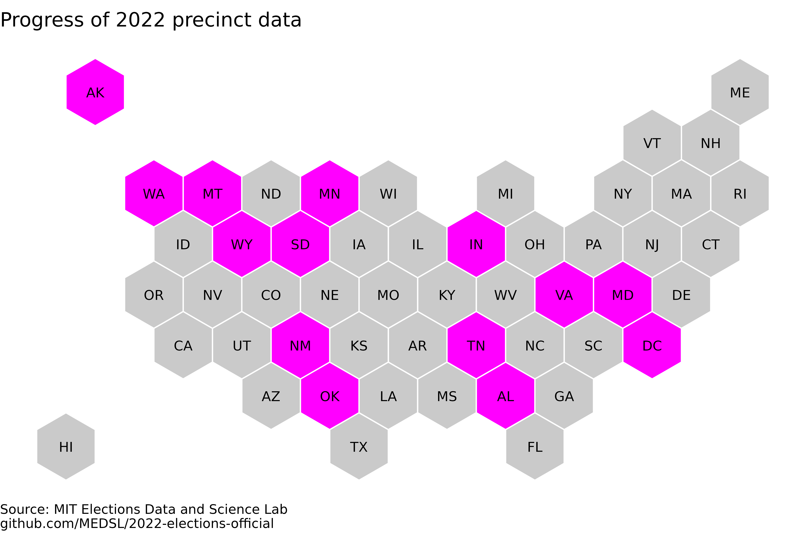

# 2022-elections-official

## Repository info
This is the MEDSL repository for election returns from the 2022 General Election in the United States. Election results are being hosted here while we compile a full national dataset and ensure the data meets our quality assurance standards. If you notice any issues in our results, please do open an Issue in this Github repository. 

So far, the following states are included in the dataset:

## Alabama

Added 2022-12-29. 

## Alaska

Added 2023-01-18.

* The 2022 election in Alaska was held using a modified form of Instant Runoff Voting, with a single-vote plurality contest followed by a second round in which four candidates compete under an Instant Runoff ruleset. Our dataset contains the data that have so far been made available from the Alaskan state government (as of the timestamp above); on their election result webpage, they explain that their precinct-level file "only shows 1st Choice results from Round 1." However, this appears to refer not to the vote counts generated by the initial single-vote plurality contest, but rather the number of first-place rankings that each candidate received in the second round (so, these are the vote counts in the Instant Runoff contest before any redistribution of votes).

* Questioned ballots are reported separately -- the meaning of these rows is explained here: http://web.archive.org/save/https://www.elections.alaska.gov/Core/votingatthepollsonelectionday.php. We retain this distinction by setting the `mode` field to the value `QUESTION` for these votes.

* Small discrepancies (substantially less than 1%) are present between the precinct-level US House race and the announced statewide vote totals in the state's "RCV Detailed Report", which may be due to unresolved write-in votes. The other statewide races, however, match the announced statewide totals exactly.

## District of Columbia

Added 2022-12-27. 

## Indiana

Added 2022-01-26.

* The precinct-level results for the US Senate race report slightly fewer votes than the statewide vote counts do, but these discrepancies are very small (a few dozen votes), and they only affects two candidates, neither of whom are the major party nominees. The US House and governor races match exactly the district- or state-level vote counts.

## Indiana

Added 2022-12-15.

* Only 36 of Indiana's 92 counties have so far released precinct-level election results in 2022. We publish these partial results now because, in 2020, only 56 counties ultimately released precinct-level results, so it is not guaranteed that Indiana's full 2022 election results will ultimately be released at the precinct level.

* We cannot conduct our usual county-level vote aggregation check in this state because counties reported at _either_ the precinct level or the county level, so the two levels of vote totals cannot be compared. So if you do want to use these data, we caution that results are non-systematically missing. Please carefully check the accuracy of any data you use from this state.

## Maryland

Added 2022-12-31.

* Maryland reported results separately from its "Mail-in Ballot 1 Canvass", which was held on November 10, 2022, and its "Mail-in Ballot 2 Canvass", which was held on November 18, 2022. Our dataset retains this distinction.

## Minnesota

Added 2023-01-13.

* In the data provided by the state, write-in candidate's names are not individually identified, but it appears that the vote total for each write-in candidate is reported individually. This means that there can be more than one candidate named "WRITE-IN" in a precinct. We retain these rows separately rather than aggregating them, in the interest of keeping as much data as possible available. In our dataset this leads to thousands of duplicated rows, or rows that are identical up to the number of votes. However, that is the only cause of duplicates; all duplicated rows are actually the vote totals of (presumably distinct) write-in candidates. The total number of write-in votes is also known to match the number of write-in votes reported at the electoral district level.

## Montana

Added 2022-12-07. 

## New Mexico

Added 2023-01-11.

## North Carolina

Added 2023-01-24.

* North Carolina reports the names of candidates that were written in. In five cases, there appears to be a candidate name written in whose name seems to be misspelling of the name of a candidate who ran for another office. These likely misspelling cases were not changed. The cases were: SAM TREADWAY and SAM TREADAWAY, TURNER VOTIPKA and TURNER VOTIPIKA, KEISHA SANDIDGE and KESHIA SANDIDGE, NATALIE MURDOCK and NATALIE S MURDOCK, and SHANNON WHITAKER and SHANNON CRAVEN WHITAKER.

## Oklahoma

Added 2022-12-27. 

## Ohio

Added 2023-01-19.

* Ohio records its data such that candidates who are not in a statewide election are listed as having recieved 0 votes at every precinct in which they were not selectable (due to running in another district). Keeping all of these candidates results in roughly 2.8 million records, and a nearly half gigabyte file. However, there is no general way to distinguish between candidates who actually received no votes in a precinct where they were selectable, and candidates who received 0 votes in a precinct because they did not appear on any ballots there. So, 0 vote records were dropped manually as follows:
  * Records for statewide elections (I.E. Governor, U.S. Senate) were kept, because these are selectable everywhere in the state
  * Records for county elections were dropped outside of the relevant county, but kept within the county, regardless of whether or not the precinct was in the correct district
  * Records for non-statewide elections (I.E. U.S. House, State House) with 0 votes were dropped

  This approach does result in records of candidates actually recieving 0 votes in a precinct in which they were selectable being dropped, but we believe this is preferable to not dropping these rows, because the dataset is unmanageably large when all the fictitious 0-vote rows are included.

* Ohio does not provide precinct-level vote totals for write-in candidates, but they do provide county-level totals. The cleaned dataset includes records for these county totals with the precinct name "COUNTY FLOATING". 

## South Dakota

Added 2023-01-15. 

## Tennessee

Added 2022-12-25. 

## Virginia

Added 2022-12-28. 

## Washington

Added 2023-01-04.

* Some pairs of rows in the dataset are identical, but each records real votes for which there is no disambiguating information available. These are all write-in votes for state house candidates. Washington's state house has contests of magnitude 2 for which write-in votes were reported separately for each of the two seats in a district, but without disambiguation, so these will appear to be either exactly duplicated, or duplicated up to the vote count. We retain them as separate rows because to combine them would be to unnecessarily remove information, but for any analysis which requires knowing the total number of write-in votes for an office in a precinct, these rows should be summed.

## Wyoming

Added 2023-01-11.
