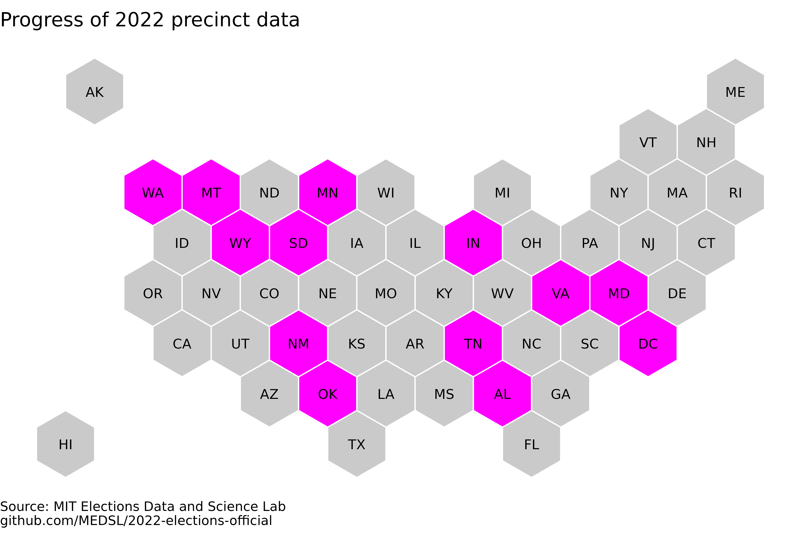

# 2022-elections-official

## Repository info
This is the MEDSL repository for election returns from the 2022 General Election in the United States. Election results are being hosted here while we compile a full national dataset and ensure the data meets our quality assurance standards. If you notice any issues in our results, please do open an Issue in this Github repository. 

So far, the following states are included in the dataset:

## Alabama

Added 2022-12-29. 

## District of Columbia

Added 2022-12-27. 

## Indiana

Added 2022-12-15.

* Only 36 of Indiana's 92 counties have so far released precinct-level election results in 2022. We publish these partial results now because, in 2020, only 56 counties ultimately released precinct-level results, so it is not guaranteed that Indiana's full 2022 election results will ultimately be released at the precinct level.

* We cannot conduct our usual county-level vote aggregation check in this state because counties reported at _either_ the precinct level or the county level, so the two levels of vote totals cannot be compared. So if you do want to use these data, we caution that results are non-systematically missing. Please carefully check the accuracy of any data you use from this state.

## Maryland

Added 2022-12-31.

* Maryland reported results separately from its "Mail-in Ballot 1 Canvass", which was held on November 10, 2022, and its "Mail-in Ballot 2 Canvass", which was held on November 18, 2022. Our dataset retains this distinction.

## Minnesota

Added 2023-01-13.

* In the data provided by the state, write-in candidate's names are not individually identified, but it appears that the vote total for each write-in candidate is reported individually. This means that there can be more than one candidate named "WRITE-IN" in a precinct. We retain these rows separately rather than aggregating them, in the interest of keeping as much data as possible available. In our dataset this leads to thousands of duplicated rows, or rows that are identical up to the number of votes. However, that is the only cause of duplicates; all duplicated rows are actually the vote totals of (presumably distinct) write-in candidates. The total number of write-in votes is also known to match the number of write-in votes reported at the electoral district level.

## Montana

Added 2022-12-07. 

## New Mexico

Added 2023-01-11. 

## Oklahoma

Added 2022-12-27. 

## South Dakota

Added 2023-01-15. 

## Tennessee

Added 2022-12-25. 

## Virginia

Added 2022-12-28. 

## Washington

Added 2023-01-04.

* Some pairs of rows in the dataset are identical, but each records real votes for which there is no disambiguating information available. These are all write-in votes for state house candidates. Washington's state house has contests of magnitude 2 for which write-in votes were reported separately for each of the two seats in a district, but without disambiguation, so these will appear to be either exactly duplicated, or duplicated up to the vote count. We retain them as separate rows because to combine them would be to unnecessarily remove information, but for any analysis which requires knowing the total number of write-in votes for an office in a precinct, these rows should be summed.

## Wyoming

Added 2023-01-11.
