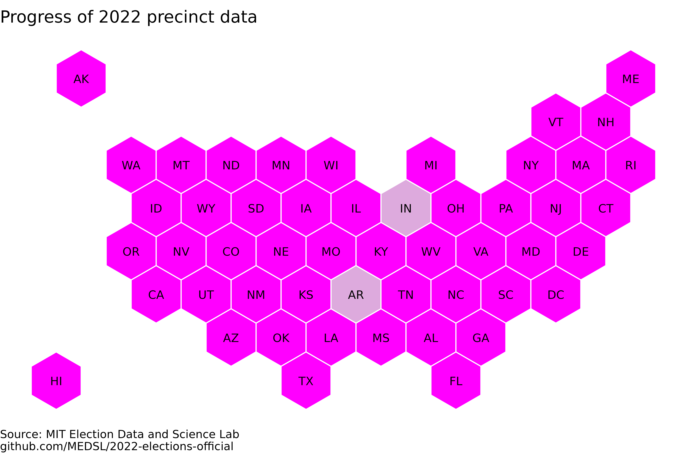

# 2022-elections-official

## Repository info
This is the MEDSL repository for election returns from the 2022 General Election in the United States. Election results are being hosted here while we compile a full national dataset and ensure the data meets our quality assurance standards. If you notice any issues in our results, please do open an Issue in this repository. 

## General usage notes
### Methods and accuracy
For any questions about how we clean and Quality Assure these data, and how accurate they are, please consult this paper, which answers those questions for our last three data efforts (2016, 2018, and 2020): https://www.nature.com/articles/s41597-022-01745-0. We ask that when you are using the data, please cite the dataset itself, and only cite that paper for discussions of how the data were created and why they are reliable.

### Warnings
In general, users need to exercise real caution when computing descriptive statistics. Please make sure you understand exactly which rows belong in the computation you're performing. Here are two of the most common issues:
* Sometimes the way that states report data generates fictitious zero-vote rows, where a candidate is recorded as getting no votes in a precinct where they did not actually appear on the ballot. It is not generally possible to ensure that all real zero-vote totals are recorded while no fictitious zero-vote totals are recorded. This could affect, for example, measures of central tendency.
* We typically retain exactly the modes that states report. This can lead to double-counting if users do not select the correct modes, for example if modes are split apart *and* a mode value of `TOTAL` is included. Users should make sure that any analysis includes votes of each mode once.

## State-specific information
So far, the following states are included in the dataset:

### Alabama

*Added:* 2022-12-29. 

*Source:* State government, https://www.sos.alabama.gov/alabama-votes/voter/election-data

### Alaska

*Added:* 2023-01-18.

*Source:* State government, https://www.elections.alaska.gov/election-results/e/?id=22genr

*Notes:*
* The 2022 election in Alaska was held using a modified form of Instant Runoff Voting, with a single-vote plurality contest followed by a second round in which four candidates compete under an Instant Runoff ruleset. Our dataset contains the data that have so far been made available from the Alaskan state government (as of the timestamp above); on their election result webpage, they explain that their precinct-level file "only shows 1st Choice results from Round 1." However, this appears to refer not to the vote counts generated by the initial single-vote plurality contest, but rather the number of first-place rankings that each candidate received in the second round (so, these are the vote counts in the Instant Runoff contest before any redistribution of votes).

* Questioned ballots are reported separately -- the meaning of these rows is explained here: http://web.archive.org/save/https://www.elections.alaska.gov/Core/votingatthepollsonelectionday.php. We retain this distinction by setting the `mode` field to the value `QUESTION` for these votes.

* Small discrepancies (substantially less than 1%) are present between the precinct-level US House race and the announced statewide vote totals in the state's "RCV Detailed Report", which may be due to unresolved write-in votes. The other statewide races, however, match the announced statewide totals exactly.

### Delaware

*Added:* 2023-03-31. 

*Source:* State government, https://elections.delaware.gov/results/html/index.shtml?electionId=GE2022#electionReport3

### District of Columbia

*Added:* 2022-12-27. 

*Source:* City government, https://electionresults.dcboe.org/election_results/2022-General-Election

### Florida

*Added:* 2023-03-03.

*Source:* State government, https://dos.myflorida.com/elections/data-statistics/elections-data/precinct-level-election-results/

*Notes:*
* The precinct field is formed as follows: `precinctCode_pollingPlaceName`. For ease of use, we follow this convention even when one of those values is empty, or when one of those values is included in (or equal to) the other one.

### Georgia

*Added:* 2023-02-15.

*Source:* State government, https://results.enr.clarityelections.com/GA/115465/web.307039/#/reporting

### Hawaii

*Added:* 2022-01-26.

*Source:* State government, https://elections.hawaii.gov/election-results/

*Notes:*
* The precinct-level results for the US Senate race report slightly fewer votes than the statewide vote counts do, but these discrepancies are very small (a few dozen votes), and they only affects two candidates, neither of whom are the major party nominees. The US House and governor races match exactly the district- or state-level vote counts.

### Idaho

*Added:* 2023-02-08.

*Source:* State government, https://sos.idaho.gov/elections-division/election-results/

*Notes:*
* The data were released by the state in spreadsheets with baroque semi-structured designs, so we wrote a custom script to parse those spreadsheets. While we are not aware of any outstanding errors produced by this process, users should be aware that the re-structuring process was substantially involved for this state, and that some information about office descriptions may have been implicitly encoded visually rather than being written out explicitly and consequently would not have been capturable by an automated parser.

* Rows labeled 'PERCENT' are nearly always -- but not quite always -- between 0 and 1. This suggests that they are usually proportions, not percentages. We have not altered the values or the labels.

* The raw data reports some precincts multiple times for the office COLLEGE OF WESTERN IDAHO TRUSTEE, but with different vote totals. We retain these rows, though this practice causes nearly duplicated rows which are identical up to vote totals (and in, one case, a coincidental exact duplicate), since they presumably refer to different precincts but using non-unique identifiers.

* Many different types of meta-information at different levels of aggregation are reported in the raw data under the label 'VOTING STATISTICS'. Where this information is exactly duplicated, we have dropped it. But in the many cases where the information represents different vote totals under the same label without explicit disambiguation in the raw data, we leave it as is.

### Indiana

*Added:* 2022-12-15.

*Source:* County governments, https://enr.indianavoters.in.gov/site/index.html

*Notes:*
* Only 36 of Indiana's 92 counties have so far released precinct-level election results in 2022. We publish these partial results now because, in 2020, only 56 counties ultimately released precinct-level results, so it is not guaranteed that Indiana's full 2022 election results will ultimately be released at the precinct level.

* We cannot conduct our usual county-level vote aggregation check in this state because counties reported at _either_ the precinct level or the county level, so the two levels of vote totals cannot be compared. So if you do want to use these data, we caution that results are non-systematically missing. Please carefully check the accuracy of any data you use from this state.

### Iowa

*Added:* 2023-02-14.

*Source:* OpenElections, https://github.com/openelections/openelections-data-ia/tree/master/2022

*Notes:*
* The sum of precinct-level votes differed from the announced constituency-level vote totals by well under 1% in the races for governor and US House districts 2, 3, and 4. The totals were off by about 1% in US House district 1. However, all totals matched exactly in the Us Senate race.

### Kansas

*Added:* 2023-01-26.

*Source:* State government, https://sos.ks.gov/elections/elections-results.html

### Kentucky

*Added:* 2023-03-22.

*Source*: State government, https://elect.ky.gov/results/2020-2029/Pages/2022.aspx

*Notes:*
* Kentucky does not explicitly identify writein candidates, and it reports a large number of write-in candidates by name. This means that it is not clear which candidates were writeins in very local elections. Some candidates without a party label (that is, a blank value of `party_detailed`, as opposed to a `party_detailed` value of `INDEPENDENT`) may be write-in candidates, but candidates in nonpartisan elections will also have blank party labels.

### Louisiana

*Added:* 2023-02-01.

*Source:* State government, https://voterportal.sos.la.gov/static/2022-11-08

### Maine

*Added:* 2023-03-02.

*Source:* State government, https://www.maine.gov/sos/cec/elec/results/2022/2022GeneralElectionNonRankedChoiceOffices.html and https://www.maine.gov/sos/cec/elec/results/2022/2022GeneralElectionRankedChoiceOffices.html

*Notes:*
* Because of the structure of election administration in Maine, these data are available at the level of towns rather than precinct-level.
* The county FIPS codes correspond to the literal counties, but jurisdiction FIPS codes represent the FIPS of the administering body. In nearly every case we were able to match the name of the town as provided in the election result data to the name of a town in a list of local government FIPS codes in Maine. In some very few cases we were not able to identify which entity a particular jurisdiction in the election data referred to in the FIPS code crosswalk, and in these cases we simply assigned the row a `jurisdiction_fips` value equal to the FIPS code of the county.
* Maine released ranked choice data for one of their two US House races, in which Maine uses Instant Runoff Voting. In the district for which the government released ranked data, our vote total column specifies the number of people who ranked each candidate in the first position on their ranked ballot
* 15 rows are duplicated up to vote totals. These near-duplicates are present in the raw data, and they remain near-duplicates in our dataset because disambiguating information is not available.

### Maryland

*Added:* 2022-12-31.

*Source:* State government, https://www.elections.maryland.gov/elections/2022/election_data/index.html

*Notes:*
* Maryland reported results separately from its "Mail-in Ballot 1 Canvass", which was held on November 10, 2022, and its "Mail-in Ballot 2 Canvass", which was held on November 18, 2022. Our dataset retains this distinction.

### Michigan

*Added:* 2023-03-17

*Source:* OpenElections, https://github.com/openelections/openelections-data-mi/tree/master/2022

* The major party candidates' vote totals in the Governor and US House races are all within 1% of their state- or district-wide totals except in district 7, where a few thousand votes are missing for both parties.
* There are substantial rows that are duplicated, or duplicated up to vote totals. These are cases where distinguishing information was not available for different precincts. It should be assumed that these refer to different precincts, but without distinguishing precinct names we do not know which precinct is which. For this reason users should be wary of aggregating data by precinct name, since that may combine different precincts which are not disambiguated in the raw data.
* Some candidates were reported as recieving both write-in votes and non-write-in votes. We retain this distinction.
* There are a small number of rows of straight party votes where different parties were reported in the candidate and party columns.

### Minnesota

*Added:* 2023-01-13.

*Last modified:* 2023-01-27.

*Source:* State government, https://electionresults.sos.state.mn.us/Select/MediaFiles/Index?ersElectionId=149

### Montana

*Added:* 2022-12-07. 

*Source:* State government, https://electionresults.mt.gov/ResultsList.aspx

### Nevada

*Added:* 2023-03-23.

*Source:* All non-ballot questions are from OpenElections, 
openelections:  https://github.com/openelections/openelections-data-nv/blob/master/2022/20221108__nv__general__precinct.csv . The ballot questions are from the state government, https://www.nvsos.gov/sos/elections/election-information/precinct-level-results .

*Notes:* 
* Per the Nevada Secretary of State, "`*` in the Votes column indicates low turnout and is hidden to protect voter privacy." We retain these suppressed rows.
* Nevada uses the notation `NPP` to mean "No Political Party". Of the 3 candidates listed under this label, 2 are described elsewhere as independents, and 1 as the "nonpartisan option".
* JANICE M RIDONDO and KATHLEEN V ANCHO both ran for 2 offices.

### New Hampshire

*Added:* 2023-02-01.

*Source:* State government, https://www.sos.nh.gov/elections/elections/election-results/2022-election-results-0/2022-general-election-results

*Notes:*
* State House district numbers are unique only up to county name, so to obtain statewide unique state house district numbers, concatenate them with the county name.

* Candidates' full names were not listed in official results for many races, and we did not alter the candidate names in these cases. In particular, New Hampshire does not provide candidate last names for most races. As such, when handling candidates, one will need to concatenate the district, office, and county to individuate between candidates who share a last name.

* Some standardization was required to ensure that the same precinct is always referred to by the same name. New Hampshire's official results inconsistenly abbreviated precinct names, so all abbreviated precinct names were unabbreviated. The official results also occasionally left off the apostrophe for the precinct "SARGENT'S PURCHASE". In the cases where it was missing, it was manually added.

* Rockingham county lists 7 votes as having been received for the state house race in its 26th district without listing which candidate recieved those votes. Based on the general format, this was manually changed to be `SCATTER` in our cleaned dataset.

* Two races had multiple recounts. To distinguish this, the second recount is referred to is labeled as "GEN RECOUNT 2".

### New Jersey

*Added:* 2023-03-01.

*Source:* State government, https://www.state.nj.us/state/elections/election-information-2022.shtml

*Notes:*
* The state of New Jersey does not collect and distribute precinct-level election results, so we instead provide results at the township level. In 2022, these are available only for state or federal offices. Because New Jersey elects its state legislators in odd-numbered years, in 2022 the only state or federal elections were for the US House, and one special election each to their upper and lower legislative chambers.

* We mark the magnitude as 1 in all races because, even though New Jersey's lower legislative chamber does use multi-member districts, the special election in this dataset elected only one candidate.

* In counties where Federal ballots are reported, we label the other modes 'NON-FEDERAL', under the assumption that they contain everything except federal overseas ballots.

### New Mexico

*Added:* 2023-01-11.

*Source:* State government, https://electionresults.sos.state.nm.us/ and https://candidateportal.servis.sos.state.nm.us/CandidateList.aspx?eid=2838&cty=99

### North Carolina

*Added:* 2023-01-24.

*Source:* State government, 
https://www.ncsbe.gov/results-data/election-results/historical-election-results-data

*Notes:*
* North Carolina reports the names of candidates that were written in. In five cases, there appears to be a candidate name written in whose name seems to be misspelling of the name of a candidate who ran for another office. These likely misspelling cases were not changed. The cases were: SAM TREADWAY and SAM TREADAWAY, TURNER VOTIPKA and TURNER VOTIPIKA, KEISHA SANDIDGE and KESHIA SANDIDGE, NATALIE MURDOCK and NATALIE S MURDOCK, and SHANNON WHITAKER and SHANNON CRAVEN WHITAKER.

### North Dakota

*Added:* 2023-02-23.

*Source:* State government, https://results.sos.nd.gov/Default.aspx?map=Cty&mode=0

### Oklahoma

*Added:* 2022-12-27. 

*Source:* State government, https://results.okelections.us/OKER/?elecDate=20221108

### Ohio

*Added:* 2023-01-19.

*Source:* State government, https://www.ohiosos.gov/elections/election-results-and-data/2022-official-election-results/

* Ohio records its data such that candidates who are not in a statewide election are listed as having recieved 0 votes at every precinct in which they were not selectable (due to running in another district). Keeping all of these candidates results in roughly 2.8 million records, and a nearly half gigabyte file. However, there is no general way to distinguish between candidates who actually received no votes in a precinct where they were selectable, and candidates who received 0 votes in a precinct because they did not appear on any ballots there. So, 0 vote records were dropped manually as follows:
  * Records for statewide elections (I.E. Governor, U.S. Senate) were kept, because these are selectable everywhere in the state
  * Records for county elections were dropped outside of the relevant county, but kept within the county, regardless of whether or not the precinct was in the correct district
  * Records for non-statewide elections (I.E. U.S. House, State House) with 0 votes were dropped

  This approach does result in records of candidates actually recieving 0 votes in a precinct in which they were selectable being dropped, but we believe this is preferable to not dropping these rows, because the dataset is unmanageably large when all the fictitious 0-vote rows are included.

* Ohio does not provide precinct-level vote totals for write-in candidates, but they do provide county-level totals. The cleaned dataset includes records for these county totals with the precinct name "COUNTY FLOATING". 

### Rhode Island

*Added:* 2023-02-28.

*Source:* State government, https://www.ri.gov/election/results/2022/general_election/data/

### South Carolina

*Added:* 2023-02-01.

*Source*: OpenElections, https://github.com/openelections/openelections-data-sc/tree/master/2022

### South Dakota

*Added:* 2023-01-15. 

*Source:* State government, https://electionresults.sd.gov/Default.aspx and https://vip.sdsos.gov/candidatelist.aspx?eid=471

### Tennessee

*Added:* 2022-12-25. 

*Source:* State government, https://sos.tn.gov/elections/results

### Vermont

*Added:* 2023-03-20.

*Source:* State government, https://sos.vermont.gov/elections/election-info-resources/elections-results-data/

*Notes:*
* District values were only available in a separate file that listed the total candidate votes within each district. We therefore matched simply by candidate name, subject to one arbitrary restriction. A major problem is that candidates will commonly be written in by a voter in one district when that candidate is actually contesting a different district. So, we match district labels onto candidate names, and then only overwrite an existing district label when a candidate appears in a(n alphabetically) subsequent district with more than (arbitrarily) 20 votes. We then manually verified that major party nominees in every house and senate district have the correct district label, but of course we cannot guarantee that is the case for minor party or write-in candidates, who will have been assigned incorrect district labels in exactly the case that they or someone with the same name received 20 or more votes in a district that comes later in the alphabet. We are not aware of any such cases, but they may exist. Note also that matching on a combination of candidate name and candidate vote totals would not correct these errors because these are overwhelmingly (if not exclusively) candidates with extremely small vote totals, who may commonly receive (say) 1 vote in multiple localities. The major effect is that names which cannot be disambiguated -- `BLANK VOTES`, `OVERVOTES`, and `UNDERVOTES` especially -- have blank district labels. However, their other geographic information is included.

* Write-in values must be inferred, since the original dataset includes all write-in candidates by name with no information that distinguishes them from other candidates, exactly as though they were not write-in candidates. We generated the write-in field by first matching to a dataset which contained official declared candidates' party labels, then manually ensuring that all major party nominees for partisan offices had party labels, and finally assuming that all other candidates which were not listed in the declared candidates file must be write-in candidates.

* We drop any row with 0 votes. The cost of doing so is that candidates may sometimes legitimately receive 0 votes in a region in which they could indeed be selected on the ballot. However, we judge that dropping 0 vote rows is more correct than not in this case. The reason is that the raw data are exceptionally sparse: in the cleaned dataset, if we do not drop zero vote rows, the resulting file has more than 3,500,000 rows and takes up 481 MB. Dropping all 0-vote rows shrinks the file by a factor of 100. This must include ample fictitious 0 vote rows, in which candidates were not selectable in a jurisdiction but nevertheless appeared in the election results as receiving no votes there -- and in many cases, write-in candidates who were selectable nowhere, received a vote in one locality, and are recorded as receiving 0 votes everywhere else. There is no way in general to distinguish between legitimate and fictitious 0-vote rows in election result data, so the most correct approach is to drop all such rows.

### Virginia

*Added:* 2022-12-28. 

*Source:* State government, https://apps.elections.virginia.gov/SBE_CSV/ELECTIONS/ELECTIONRESULTS/2022/

### Washington

*Added:* 2023-01-04.

*Source:* State government, https://results.vote.wa.gov/results/20221108/turnout.html and https://kingcounty.gov/depts/elections/results/2022/202211.aspx 

*Notes:*
* Some pairs of rows in the dataset are identical, but each records real votes for which there is no disambiguating information available. These are all write-in votes for state house candidates. Washington's state house has contests of magnitude 2 for which write-in votes were reported separately for each of the two seats in a district, but without disambiguation, so these will appear to be either exactly duplicated, or duplicated up to the vote count. We retain them as separate rows because to combine them would be to unnecessarily remove information, but for any analysis which requires knowing the total number of write-in votes for an office in a precinct, these rows should be summed.

### West Virginia

*Added:* 2023-02-03.

*Source:* OpenElections, https://github.com/openelections/openelections-data-wv/tree/master/2022

### Wyoming

*Added:* 2023-01-11.

*Source:* State government, https://sos.wyo.gov/Elections/Docs/2022/2022GeneralResults.aspx
